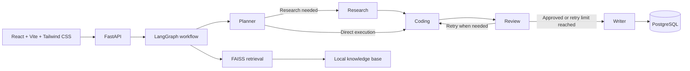

# Multi-Agent Software Engineering Assistant

A full-stack AI application that turns a software-engineering request into a structured, reviewable workflow. The system coordinates specialist agents for planning, research, implementation, review, and delivery; persists the complete execution trail; and exposes the result through a FastAPI API and React dashboard.

## Why this project

Most AI demonstrations stop at a single model response. This project focuses on the engineering concerns behind a multi-step AI workflow:

- **Specialization:** dedicated planner, research, coding, review, and writer agents with clear responsibilities.
- **Orchestration:** a LangGraph state machine selects the appropriate path, supports research when required, and retries failed reviews up to a configured limit.
- **Traceability:** every conversation stores its request, agent messages, execution timing, generated artifacts, and final status in PostgreSQL.
- **Knowledge grounding:** a retrieval-augmented generation layer can supply context from a local document corpus.
- **Usability:** the React dashboard provides workflow initiation, live system status, statistics, and inspectable run history.

## Architecture



## Technology stack

| Area | Technologies |
| --- | --- |
| Backend | Python 3.12, FastAPI, Pydantic, Uvicorn |
| Agent orchestration | LangGraph, LangChain, OpenAI API |
| Retrieval | FAISS, document loading and chunking pipeline |
| Persistence | PostgreSQL, SQLAlchemy, Alembic |
| Frontend | React 18, Vite 6, Tailwind CSS 4, Axios |
| Delivery | Docker and Docker Compose |
| Testing | Pytest and FastAPI test utilities |

## Workflow lifecycle

1. A user submits an engineering request through `POST /api/v1/generate`.
2. The planner creates an execution plan and determines whether research is required.
3. The research agent retrieves relevant context when the plan needs it.
4. The coding agent completes each implementation-oriented task in the plan.
5. The review agent evaluates the output. Failed reviews return to the coding stage until the configured retry limit is reached.
6. The writer produces the final response and artifacts.
7. The system persists the conversation, messages, execution history, artifacts, and completion status.

## Repository structure

```text
app/
  agents/          Specialist agent implementations
  api/             FastAPI routes and request/response schemas
  db/              SQLAlchemy models, repositories, and sessions
  graph/           LangGraph state, routing, and execution service
  rag/             Retrieval, embedding, and vector-store components
  services/        Application services and persistence coordination
  prompts/         Agent-specific prompt templates
frontend/
  src/             React dashboard and API client
migrations/        Alembic database migrations
tests/             Unit and API tests
data/              Source documents for retrieval
```

## Getting started

### Prerequisites

- Python 3.12 or later
- Node.js 20 or later
- PostgreSQL 16 or Docker Desktop
- An OpenAI API key

### 1. Configure environment variables

Copy the template and add your own credentials. Never commit a real API key.

```powershell
Copy-Item .env.example .env
```

Update `.env` with a valid `OPENAI_API_KEY` and the correct `DATABASE_URL` for your PostgreSQL instance.

### 2. Start the backend locally

Create and activate a virtual environment, then install the dependencies:

```powershell
python -m venv venv
.\venv\Scripts\Activate.ps1
pip install -r requirements.txt
```

Apply database migrations and start FastAPI:

```powershell
alembic upgrade head
uvicorn app.main:app --reload --host 127.0.0.1 --port 8000
```

The API is available at `http://127.0.0.1:8000`. Interactive API documentation is available at `http://127.0.0.1:8000/docs`.

### 3. Start the frontend

Open a second terminal:

```powershell
cd frontend
npm install
npm run dev
```

Open `http://localhost:3000`. The Vite development server proxies `/api` requests to the backend at port `8000`.

### Docker setup

Docker Compose starts PostgreSQL and the backend, applies migrations, and exposes the API on port `8000`.

```powershell
Copy-Item .env.example .env.docker
# Set DATABASE_URL to: postgresql+psycopg://postgres:postgres@db:5432/multi_agent_db
# Set OPENAI_API_KEY to your own key
docker compose up --build
```

Run the frontend separately using the commands in the previous section.

## API overview

| Method | Endpoint | Purpose |
| --- | --- | --- |
| `GET` | `/health` | Service health check |
| `POST` | `/api/v1/generate` | Execute the multi-agent workflow for a user request |
| `GET` | `/api/v1/conversations` | List persisted conversations with pagination and filtering |
| `GET` | `/api/v1/conversations/{conversation_id}` | Retrieve a conversation, messages, artifacts, and execution history |
| `DELETE` | `/api/v1/conversations/{conversation_id}` | Delete a persisted conversation |
| `GET` | `/api/v1/stats` | Retrieve dashboard metrics |

Example request:

```bash
curl -X POST http://127.0.0.1:8000/api/v1/generate \
  -H "Content-Type: application/json" \
  -d '{"user_query":"Design a secure document-sharing API with role-based access control."}'
```

## Quality checks

Run backend tests from the repository root:

```powershell
python -m pytest -q
```

Build the frontend for production:

```powershell
cd frontend
npm run build
```

## Design decisions

- **LangGraph for workflow control:** explicit routing and typed state make execution paths, review retries, and failure handling easier to understand than an unstructured agent loop.
- **Repository and unit-of-work pattern:** data access remains isolated from business services, which keeps persistence logic testable and replaceable.
- **Persisted observability:** agent latency, outputs, artifacts, and messages are part of the product record rather than temporary logs.
- **Separate frontend and backend:** the UI can evolve independently while the FastAPI application remains usable through its documented API.

## Security notes

- Store credentials only in local environment files or your deployment secret manager.
- `.env` files are ignored by Git; use `.env.example` as the safe configuration template.
- If a credential is ever committed, revoke it immediately and replace it with a new key.

## Current scope

This repository is designed as a portfolio-grade engineering project and a foundation for further development. Production deployment should add authentication, authorization, request rate limiting, centralized secret management, observability infrastructure, and a managed database configuration.
